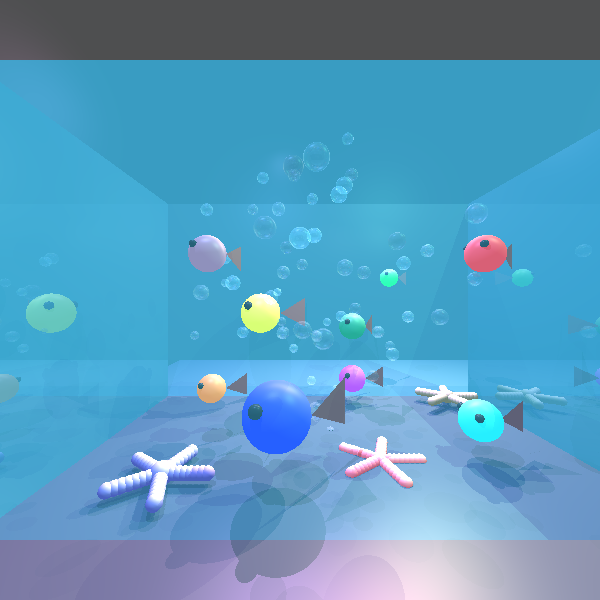
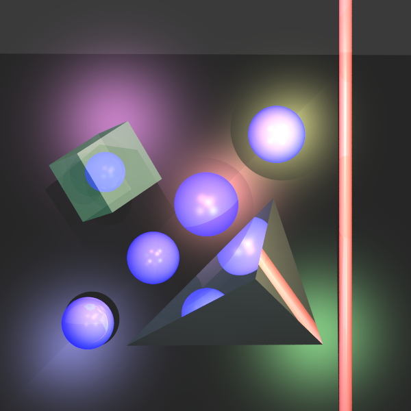

# Java Raytracing Engine

A high-performance, pure Java implementation of a Raytracing renderer, built from scratch without external graphics engines. This project demonstrates core computer graphics concepts alongside rigorous software engineering practices including Test-Driven Development (TDD) and Clean Architecture.


## Sample Output

| Scene 1 | Scene 2 |
|---------|----------|
|  |  |
| Complex Geometry & Refraction | Procedural Content Generation |

## Key Features

* **Adaptive Super-Sampling (ASSAA):** <br>
Implemented a smart recursive anti-aliasing algorithm. The engine samples pixel corners and only subdivides/recurses when color contrast exceeds a threshold, significantly optimizing rendering time compared to naive supersampling.
* **High-Performance Concurrency:** <br>
Thread-pool based architecture using a `PixelManager` monitor to synchronize threads and prevent race conditions, allowing efficient parallel rendering on multi-core CPUs.
* **Procedural Scene Generation:** <br>
Created parametric functions to generate complex 3D models (e.g., parameterized marine life, randomized particle systems for bubbles) to avoid code duplication and enhance scene variety.
* **Advanced Lighting Model:** <br>
Full implementation of Phong shading including ambient, diffuse, and specular components, along with shadow ray casting.
* **Clean Architecture:** <br>
Strictly adheres to SOLID principles, separating geometric calculations, scene management, and rendering logic.

## Performance Optimization Analysis

To validate the engine's efficiency, we conducted benchmarks on a high-complexity scene (80 rays per pixel beam). The results demonstrate a **~80% reduction in rendering time** when combining Multi-threading with Adaptive algorithms.

| Configuration | Rendering Time | Improvement |
|:---|:---|:---|
| **Naive Implementation** (Single Thread, No Optimization) | 22m 38s | Baseline |
| **Multi-Threading Only** (3 Threads) | 10m 33s | ~53% Faster |
| **Adaptive Super-Sampling Only** | 10m 36s | ~53% Faster |
| **Combined Optimization** (Adaptive + Multi-Threading) | **04m 42s** | **~79% Faster** |

## Architecture Highlights

This project was built with a focus on maintainability and algorithmic efficiency:

* **Concurrency Model:** <br>
The engine uses a `PixelManager` to divide the screen into tasks. Threads request the next available pixel index in a thread-safe manner, ensuring 100% CPU utilization without overlapping work.

* **Adaptive Recursive Algorithm:** <br>
    Instead of casting fixed rays per pixel, the engine operates recursively: <br>
    1. Cast rays at 4 corners of a pixel/sub-pixel. <br>
    2. Compare colors against a similarity threshold. <br>
    3. If dissimilar: Split the quadrant into 4 sub-quadrants and recurse (up to a defined depth). <br>
    4. If similar: Average the colors and return (Pruning the recursion tree). <br>

* **Ray-Surface Intersection:** <br>
    1. Ray Generation – Create rays from camera through image plane pixels. <br>
    2. Intersection Testing – Find closest intersection with scene geometry. <br>
    3. Lighting Calculation – Compute Phong illumination at intersection points. <br>
    4. Color Determination – Blend colors based on material properties. <br>
    5. Output Rendering – Write pixel values to output image. <br>

## Repository Structure

```
.
├── src/
│   ├── geometries/             # 3D geometric primitives (Sphere, Plane, Triangle)
│   ├── math/                   # Vector3D, Point3D, ray mathematics
│   ├── rendering/              # Main raytracing engine, PixelManager
│   ├── lighting/               # Phong shading, light sources
│   └── scene/                  # Scene management, procedural generation
├── uniTests/                   # Comprehensive JUnit test suite
├── lib/                        # External dependencies
├── images/                     # Rendered output samples
└── README.md
```

## Getting Started

### Prerequisites

- Java 8 or higher
- JUnit 4 (for testing)

### Installation & Execution

1. **Clone the Repository**

```bash
git clone https://github.com/nafbarg/ISE5784_6082_3840.git
cd ISE5784_6082_3840
```

2. **Compile the Project**

```bash
javac -cp lib/* -d bin src/**/*.java
```

3. **Run the Application**

```bash
java -cp bin:lib/* ImageWriter
```

4. **Run Unit Tests**

```bash
java -cp bin:lib/*:uniTests org.junit.runner.JUnitCore src.test.AllTests
```

## Code Quality Standards

This project adheres to professional software engineering practices:

✓ **Object-Oriented Design** – Clear separation of concerns with well-defined classes and interfaces  <br>
✓ **SOLID Principles** – Single Responsibility, Open/Closed, Liskov Substitution, Interface Segregation, Dependency Inversion  <br>
✓ **Test-Driven Development** – Comprehensive unit tests written alongside feature implementation  <br>
✓ **Version Control** – Clean git history with meaningful commit messages  <br>
✓ **Code Documentation** – Detailed comments and method documentation  <br>
✓ **Concurrency Safety** – Thread-safe implementations using monitors and synchronization primitives

## Development Phases

### Phase 1: Mathematical Infrastructure
- Vector3D and Point3D classes with comprehensive operations
- Ray representation and directional vectors
- Cross product, dot product, and scalar operations

### Phase 2: Geometric Primitives
- Support for Sphere, Plane, and Triangle geometries
- Intersection detection algorithms with parametric calculations
- Surface normal calculations for lighting

### Phase 3: Ray-Surface Intersection
- Core ray casting algorithm implementation
- Precision handling for floating-point calculations
- Geometric intersection testing optimization

### Phase 4: Lighting and Shading
- Point light source implementation
- Phong reflection model (ambient, diffuse, specular)
- Shadow ray casting and visibility determination

### Phase 5-7: Advanced Features & Optimization
- Procedural scene generation with parametric functions
- Adaptive Super-Sampling anti-aliasing with recursive threshold checking
- Multi-threaded rendering with PixelManager synchronization
- Final optimization achieving 79% performance improvement

## Professional Development Practices

✓ Peer code reviews within team  <br>
✓ Automated unit testing for regression prevention  <br>
✓ Meaningful commit messages documenting changes  <br>
✓ Branch-based development with comprehensive testing  <br>
✓ Documentation-first approach for complex algorithms <br>

## Project Statistics

- **Language:** Java 100% <br>
- **Total Commits:** 42 <br>
- **Contributors:** 2 <br>
- **Lines of Code:** ~3,500+ LOC <br>
- **Performance Gain:** 79% rendering time reduction (Multi-threading + Adaptive ASSAA) <br>
- **Test Coverage:** Comprehensive unit test suite with geometric and algorithmic tests <br>

## Release History

- **v7.1** (Latest) - July 9, 2024 – Final optimizations and visual refinements
- **v7.0** – Complete feature parity with all core raytracing functionality
- See [Releases](https://github.com/nafbarg/ISE5784_6082_3840/releases) for detailed version history

## Development Tools

- **IDE:** IntelliJ IDEA Community Edition
- **Build Tool:** Maven/Gradle (optional)
- **Version Control:** Git with GitHub
- **Testing Framework:** JUnit 4
- **Concurrency Framework:** Java ExecutorService, Thread-pool synchronization
- **Code Analysis:** Built-in IDE inspections

## Contact & Support

For technical inquiries, questions about the implementation, or collaboration:

- **Naftali Bar-giora** – [@nafbarg](https://github.com/nafbarg)
- **Itamar Pozaylov** – [@itamarPoz](https://github.com/itamarPoz)

Please open an issue on GitHub for bugs or feature requests.

## Course Information

**Course:** Introduction to Software Engineering  <br>
**Project Type:** Capstone Mini-Project  <br>
**Language:** Java  <br>
**Focus Areas:** Computer Graphics, Concurrency, Algorithm Optimization, Software Engineering Principles  <br>

## License

This project is created for educational and portfolio purposes. Feel free to use it as reference material or learning resource.

---

**Last Updated:** January 19, 2026  <br>
**Status:** Active Development & Maintenance  <br>
**Performance Target:** Real-time rendering on consumer hardware
